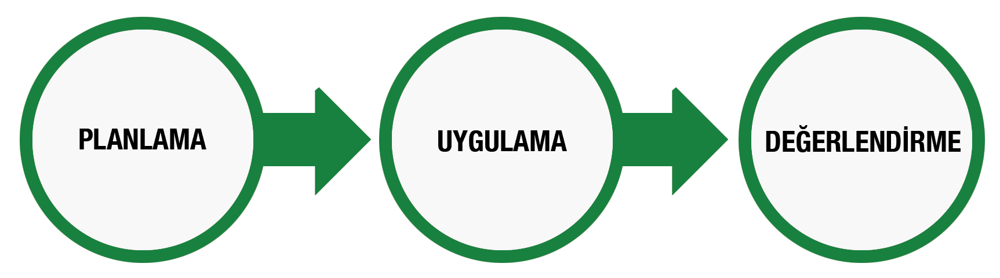
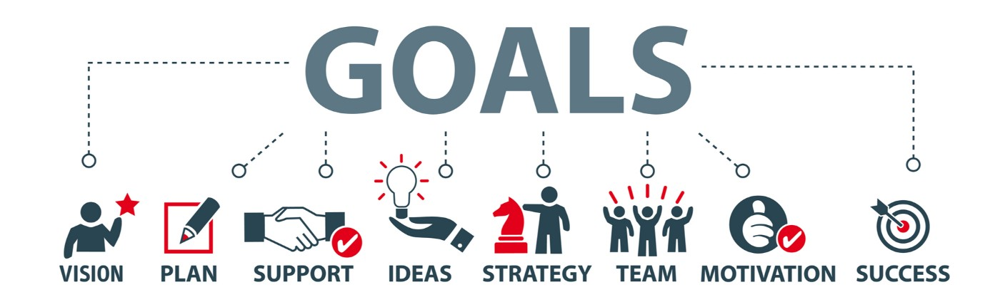
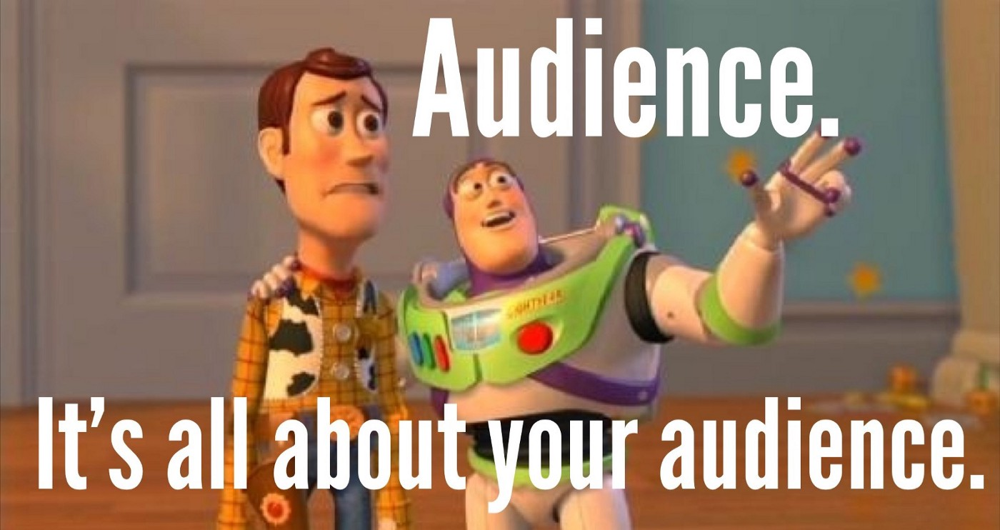
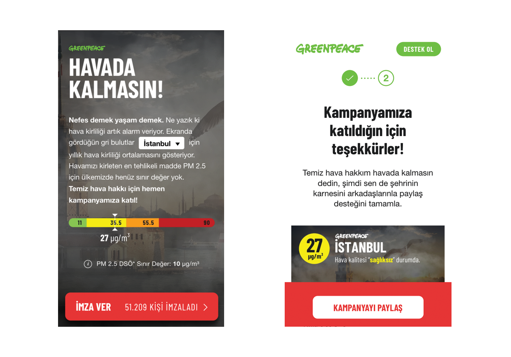
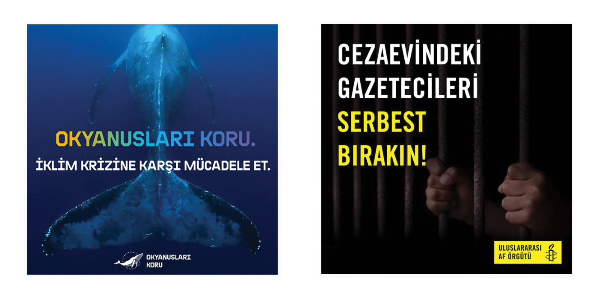

## Dijital kampanya stratejisi hazırlamak 

Korona virüsü sırasında da gördük ki, özel şirketler gibi büyük reklam bütçeleri olmayan sivil toplum kuruluşları için dijital iletişim hayati bir öneme sahip. 

Yeni başlayacak projenizin dijital ayağında en iyi sonuçları elde etmek için proje başlangıcından önce aşağıdaki adımları takip ederek bir dijital kampanya stratejisi oluşturabilirsiniz.

## Planlama

### Hedefleri belirlemek

Dijital kampanya stratejisini oluştururken sormamız gereken en önemli soru: Hedefimiz ne?

Kolay gibi gözükse de hedefleri belirlemek etkili bir strateji hazırlamak için çok önemli bir başlangıç. Hedeflerimizi belirlerken dikkat etmemiz gereken en önemli nokta belirlediğimiz hedeflerin ulaşılabilir ve ölçülebilir olması.

100 bin kişi imza kampanyamıza katılacak, 50 bin kişi bağış yapacak, bin kişi belediye başkanına mektup gönderecek gibi net ve ölçülebilir hedefler belirlememiz gerekiyor.

### Hedef kitleyi belirlemek

Kampanyanın hedefini belirledik, sırada bu hedefleri gerçekleştirmek için hangi hedef kitleye ulaşmamız gerektiğine karar vermek var.

Hedef kitlenizi doğru seçmek için kurumunuzun halihazırdaki hedef kitlesini iyi analiz etmek ve kampanyanız hakkında kimlerin daha kolay harekete geçeceğini belirlemek çok önemli.

Hedef kitlelerinizi belirlerken de olabildiğince net ve spesifik olmak çok önemli. 18-65 yaş, büyükşehirlerde yaşayan kadın ve erkekler gibi çok geniş bir kitle yerine kampanyanızın gerçekten kime hitap ettiğini belirlemeniz diğer aşamaları da şekillendirecek önemli bir adım.

### Hedef kitleye uygun kanalların belirlenmesi

Hedef kitlemi nerede bulurum? 

Facebook, Twitter, Instagram, Youtube, TikTok, Telegram, Pinterest, Ekşi Sözlük, t24.com… Bu kanalların hepsi olabilir. Hedef kitlenize göre öncelikli kanallarınızı belirlemeli ve içerik stratejinizi bu kanallara yoğunlaşarak oluşturmalısınız. 

Öncelikli kanallarınızı belirlemek diğer kanallarda bir şey yapmayacağınız anlamına gelmez. Sadece hangi kanal için içerik üretirken daha fazla zaman harcamanızı ve o kanalın ruhuna uygun içerikler üretmeniz gerektiğini size söyler.

İçerik ve reklam stratejimizi oluşturarak planlama kısmını sonlandırabilir, uygulamaya geçebiliriz.

Ne kadar bütçeniz olduğu da önemli tabi ama onun kadar önemli bir şey daha var, bu bütçeyi nasıl kullandığınız. Reklamları oluştururken olabildiğince oluşturduğunuz kanalın ruhuna uygun reklamlar üretmeye çalışın. Görselleriniz ve metniniz net olsun, insanlardan ne istiyorsanız net bir şekilde ifade edin ve olabildiğince test edin.

## Uygulama

### Lansman ve ilk değerlendirme

Lansmanı yaptık ve stratejimiz ışığında iletişime devam ediyoruz. Bu noktada özellikle lansman sonrası ilk birkaç hafta çok önemli.

Web sitemizin performansı iyi mi? İçeriklerimiz istediğimiz geri dönüşü alıyor mu? 

Belirlediğimiz sorunları ve iyileştirmeleri hızlıca yapmak kampanyanın bütün başarısını etkileyebilecek çok önemli bir adım.

### Ara değerlendirme, yeniden planlama

Değerlendirme projenin bitişinden daha çok uygulama kısmında işinize yarayacak bir araçtır. Gidişata göre yaptığınız ara değerlendirmeler ve onların ışığında yaptığınız iyileştirmeler hayat kurtarabilir.

## Değerlendirme ve raporlama

Dijital ekipte yer almasa bile kampanya ekibinin içerisinde olan herkesin katılımına açık bir değerlendirme süreci sonraki projeleri de şekillendirecek ve onların da başarısını etkileyecektir. 

Değerlendirme sonrası oluşturulacak rapor objektif ve uzun vadede ulaşılabilir olmalı. 

### Araçlar

## Web siteleri / imza kampanyaları

Kampanya hedeflerini belirlerken olduğu gibi web sitesi veya imza sayfalarından da beklentilerimizi iyi belirlememiz önemli. 

Siteye gelen insanların ne yapmalarını istiyorsanız tasarım ve geliştirmeyi ona odaklı yapmanız sitenin başarı oranını artıracaktır. 

# İmza sitesi hazırlarken dikkat edilmesi gerekenler:

- Site oldukça sade olmalı, karışık metinlerden kaçınılmalı
- İnsanların kolayca ne için imza verdiklerini anlamaları sağlanmalı
- Siteye girer girmez hem mobil hem masaüstünde imza formu gözükmeli
- Site metni içerisinde farklı sayfalara bağlantı verilmemeli
- Mobil uyumlu değil mobil öncelikli olmalı
- Geç açılan siteler büyük oranda kullanıcı kaybına yol açar. Site hızınızı takip edin.

## Sosyal medya gönderileri

Kampanya hedefi doğrultusunda hazırlanan sosyal medya içerikleri yayınlanacak kanalın doğasına uygun olmalı. Örneğin, Twitter’da kare görsel kullanmamak, Instagram postlarında metnin içerisinde bağlantı paylaşmamak gibi.

Sosyal medya gönderilerinde de web sitesinde olduğu gibi yalın bir dil kullanmak ve insanlardan istediğimiz şeyi açık ifade etmemiz önemli.

Sade bir dil kullanın. İnsanlar gönderinizi anlamakta zorlanmasın.
Takipçilerinize soru sormaktan çekinmeyin. Onlarla iletişime girin. Engagement anlamında olumlu geri dönüşü olacaktır.
Test edin. Dijitalde başarılı olmanın en büyük anahtarı test etmeyi bir kurum içi kültürü haline getirmekte. Yeni kanalları, yeni post şekillerini test etmekten çekinmeyin.

## Dijital reklamlar

Kampanya başlamadan önce lansman ve sonrası için reklam planınızı iyi yapın. İnsanlardan talep ettiğiniz şeye göre maliyet hesaplamaları yaparsanız bütçenizi çok daha etkili kullanabilirsiniz.
Maliyet hesaplamanız için kıstaslarınızı belirleyin. İmza başına maliyet, izlenme başına maliyet gibi.
Test için birkaç farklı metin ve birkaç farklı görsel oluşturun. Hedef kitlelerinizi iyi belirleyin.
Esnek olun. İyi giden reklamları artırın, kötü gidenleri kapatın.

## E-mailingler

Son birkaç sene içerisinde popülerliğini yitirmiş olsa da mailingler geri dönüş anlamında her zaman en iyi kanallardan biri olmaya devam ediyor.

Kurumunuzla e-posta adresini paylaşmış insanlar yeni kampanyalar için de en ilgili kitle olacaktır. 

Listenize e-posta göndermeden önce yapabileceğiniz ve performansı etkileyen birkaç basit taktik: 

En az 3 tane “subject line” seçip e-postayı bütün kitleye göndermeden önce hangisinin daha iyi çalıştığınız kitlenizin %10’u üzerinde test edin.
İlk cümleler çok önemli. İnsanların çoğu e-postaları birkaç cümle okuduktan sonra kapatıyorlar. O yüzden ilk birkaç cümlede mesajınız net olsun ve okuyandan talebinizi belirtin.
Metin biçimlendirmeyi etkili kullanın. İnsanlar e-postayı açtıkları zaman tarama yaparak okumaya daha yatkınlar. O yüzden sadece “bold” metinleri okuyan insanların bile e-postayı anlayabilecekleri şekilde tasarlayın.

